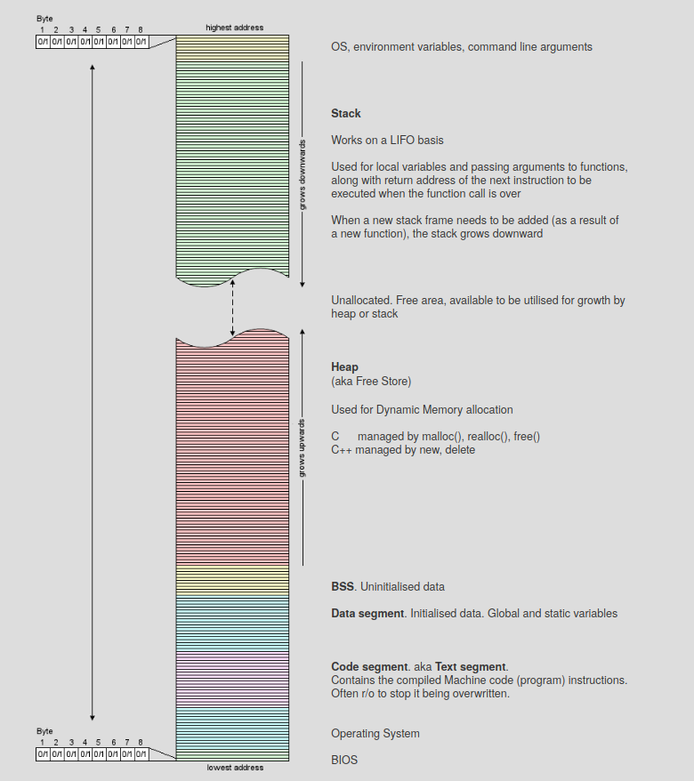

# Object Oriented Programming:  

Basic concepts in Object Oriented Programming:  
- Classes: Blueprint
- Object: An instance of the class
- Encapsulation: Wrap up relevant information under units  
- Abstraction: Reveal only what is necessary (Can be using classes or headers) 
- Polymorphism: Same names, different purposes (overloading)
- Inheritance: Reuse what can be reused, inherit from parent

**Access Modifiers:**

- Public: They can be accessed by everyone. 

```cpp
#include <bits/stdc++.h> 
using namespace std; 
class Demo 
{ 
    // Access specifier 
    public: 
  
    // Data Members 
    string name; 
  
    // Member Functions() 
    void printname() 
    { 
       cout << "Demo name is: " << name; 
    } 
}; 
```

The function can be declared in the class and defined outside or in another file using scope resolution like so.  

```cpp
#include <bits/stdc++.h> 
using namespace std; 
class Demo 
{ 
    // Access specifier 
    public: 
  
    // Data Members 
    string name; 
  
    // Member Functions() 
    void printname();
}; 

Demo::printname()
    {
    cout << "Demo name is: " << name; 
    }
```

- Private: Can only be accessed inside the class. Only member functions can access the private variables with exception of friend class. The code below would give compiler error as we try to access the private member outside the class.  

```cpp

#include<iostream> 
using namespace std; 
  
class Circle 
{    
    // private data member 
    private:  
        double radius; 
       
    // public member function     
    public:     
        double  compute_area() 
        {   // member function can access private  
            // data member radius 
            return 3.14*radius*radius; 
        } 
      
}; 
  
// main function 
int main() 
{    
    // creating object of the class 
    Circle obj; 
      
    // trying to access private data member 
    // directly outside the class 
    obj.radius = 1.5; 
      
    cout << "Area is:" << obj.compute_area(); 
    return 0; 
} 
```  

- Protected : Similar to private, but can be accessed by the sub-class which inherits it.  

```cpp
class Parent 
{    
    // protected data members 
    protected: 
    int id_protected; 
     
}; 
  
// sub class or derived class 
class Child : public Parent 
{ 
     
      
    public: 
    void setId(int id) 
    { 
          
        // Child class is able to access the inherited  
        // protected data members of base class 
          
        id_protected = id; 
          
    } 
      
    void displayId() 
    { 
        cout << "id_protected is: " << id_protected << endl; 
    } 
}; 
  
```

**Constructors and Destructors**  
These are methods with same name as that of the class, and are called whenever an object is created. Similarly, distructors are called when the object goes out of scope or is deleted.  

```cpp
#include <bits/stdc++.h> 
using namespace std; 
class Demo 
{ 
    public: 
    int id; 
      
    //Default Constructor 
    Demo() 
    { 
        cout << "Default Constructor called" << endl;  
        id=-1; 
    } 
      
    //Parametrized Constructor 
    Demo(int x) 
    { 
        cout << "Parametrized Constructor called" << endl; 
        id=x; 
    } 

    //Destructor
    ~Demo() 
    { 
        cout << "Destructor called for id: " << id <<endl;  
    } 
}; 
```

**Inheritance**  
The class can be inherited into another class which can use its properties, this makes it easy to reuse the code. The inheriting class is Child or sub class and the other is parent or base class or super class.  

```cpp
#include <bits/stdc++.h> 
using namespace std; 
  
//Base class 
class Parent 
{ 
    public: 
      int id_p; 
}; 
   
// Sub class inheriting from Base Class(Parent) 
class Child : public Parent 
{ 
    public: 
      int id_c; 
}; 
  
//main function 
int main()  
   { 
       
        Child obj1; 
           
        // An object of class child has all data members 
        // and member functions of class parent 
        obj1.id_c = 7; 
        obj1.id_p = 91; 
        cout << "Child id is " <<  obj1.id_c << endl; 
        cout << "Parent id is " <<  obj1.id_p << endl; 
          
        return 0; 
   }  
```

Notice that the class was inherited as public. The image below captures most of what you need to know:  
  

**Polymorphism**  
- Compile time: 

1. Function overloading  

```cpp
#include <bits/stdc++.h> 
  
using namespace std; 
class Geeks 
{ 
    public: 
      
    // function with 1 int parameter 
    void func(int x) 
    { 
        cout << "value of x is " << x << endl; 
    } 
      
    // function with same name but 1 double parameter 
    void func(double x) 
    { 
        cout << "value of x is " << x << endl; 
    } 
      
    // function with same name and 2 int parameters 
    void func(int x, int y) 
    { 
        cout << "value of x and y is " << x << ", " << y << endl; 
    } 
}; 
```

2\. Operator overloading  
```cpp
#include<iostream> 
using namespace std; 
   
class Complex { 
private: 
    int real, imag; 
public: 
    Complex(int r = 0, int i =0)  {real = r;   imag = i;} 
       
    // This is automatically called when '+' is used with 
    // between two Complex objects 
    Complex operator + (Complex const &obj) { 
         Complex res; 
         res.real = real + obj.real; 
         res.imag = imag + obj.imag; 
         return res; 
    } 
    void print() { cout << real << " + i" << imag << endl; } 
}; 
```  

- Run time   

_Function Overriding_ : This can override the base class methods which are defined virtual. This happens at the run time, bptr points to the derived object address but it cannot access any members that are not in the base class. Pointing it to a derived class address only overrides the virtual methods

```cpp
#include <bits/stdc++.h> 
using namespace std; 

class base 
{ 
public: 
	virtual void print () 
	{ cout<< "print base class" <<endl; } 

	void show () 
	{ cout<< "show base class" <<endl; } 
}; 

class derived:public base 
{ 
public: 
	void print () //print () is already virtual function in derived class, we could also declared as virtual void print () explicitly 
	{ cout<< "print derived class" <<endl; } 

	void show () 
	{ cout<< "show derived class" <<endl; } 
}; 

//main function 
int main() 
{ 
	base *bptr; 
	derived d; 
	bptr = &d; 
	
	//virtual function, binded at runtime (Runtime polymorphism) 
	bptr->print(); 
	
	// Non-virtual function, binded at compile time 
	bptr->show(); 

	return 0; 
} 
```

- More info [here](https://www.geeksforgeeks.org/virtual-functions-and-runtime-polymorphism-in-c-set-1-introduction/)

**Structure vs Class**  
- In class, members are private by default, and in structure, they are public by default.
Class:

```cpp
#include <stdio.h> 
  
class Test { 
    int x; // x is private 
}; 
int main() 
{ 
  Test t; 
  t.x = 20; // compiler error because x is private 
  getchar(); 
  return 0; 
} 
```

Struct:  

```cpp
#include <stdio.h> 
  
struct Test { 
    int x; // x is public 
}; 
int main() 
{ 
  Test t; 
  t.x = 20; // works fine because x is public 
  getchar(); 
  return 0; 
} 
```

- While inheriting, default access specifiers are public in struct and private in classes. 

**Static Members**  
- They must be defined outside the class. They also cannot be accessed without a definition.  
- The code below only calls the constructor of B, because A is not defined. 

```cpp

#include <iostream> 
using namespace std; 
  
class A 
{ 
public: 
    A() { cout << "A's Constructor Called " << endl;  } 
}; 
  
class B 
{ 
    static A a; 
public: 
    B() { cout << "B's Constructor Called " << endl; } 
}; 
  
int main() 
{ 
    B b; 
    return 0; 
} 

```
- The code below throws error because 'a' is not defined. 

```cpp

#include <iostream> 
using namespace std; 
  
class A 
{ 
    int x; 
public: 
    A() { cout << "A's constructor called " << endl;  } 
}; 
  
class B 
{ 
    static A a; 
public: 
    B() { cout << "B's constructor called " << endl; } 
    static A getA() { return a; } 
}; 
  
int main() 
{ 
    B b; 
    A a = b.getA(); 
    return 0; 
} 

```

- The program below calls B's constructor thrice but A's only once. Because static members are shared.  

```cpp
#include <iostream> 
using namespace std; 
  
class A 
{ 
    int x; 
public: 
    A() { cout << "A's constructor called " << endl;  } 
}; 
  
class B 
{ 
    static A a; 
public: 
    B() { cout << "B's constructor called " << endl; } 
    static A getA() { return a; } 
}; 
  
A B::a;  // definition of a 
  
int main() 
{ 
    B b1, b2, b3; 
    A a = b1.getA(); 
  
    return 0; 
} 
```

**Friend**

- Class: A friend class can access private and protected members of the other class. 

```cpp

class Node { 
private: 
    int key; 
    Node* next; 
    /* Other members of Node Class */
  
    // Now class  LinkedList can 
    // access private members of Node 
    friend class LinkedList; 
}; 

```

- Function: A friend function can similarly access private and protected members of the other class. 

```cpp

class Node { 
private: 
    int key; 
    Node* next; 
  
    /* Other members of Node Class */
    friend int LinkedList::search(); 
    // Only search() of linkedList 
    // can access internal members 
}; 
```

- Example for syntax and usage:  

```cpp
#include <iostream> 
class A { 
private: 
    int a; 
  
public: 
    A() { a = 0; } 
    friend class B; // Friend Class 
}; 
  
class B { 
private: 
    int b; 
  
public: 
    void showA(A& x) 
    { 
        // Since B is friend of A, it can access 
        // private members of A 
        std::cout << "A::a=" << x.a; 
    } 
}; 
```

- Friendship is not mutual and not inherited.  
- More info [here]((https://www.geeksforgeeks.org/friend-class-function-cpp/)  


**Abstract Classes and Pure Virtual Functions**

- Abstract class is the class with at least one pure virtual function. We cannot create objects of abstract class. It serves as a basic framework for deriving other classes. If derived class doesn't override virtual function, it is also abstract. 
- Pure virtual function is a virtual function with no definition, only declaration. It is declared as:  

```cpp

// An abstract class 
class Test 
{    
    // Data members of class 
public: 
    // Pure Virtual Function 
    virtual void show() = 0;  //Notice, no declaration using '{ }'
    
   /* Other members */
}; 

```

# Memory Allocation  

- Used for allocating memory of variable sizes, which cannot be done by compiler (except variable size arrays)
- We can allocate and deallocate at our will  

**Memory Layout**  
  

**New and delete**

When dynamically allocating, HEAP memory is assigned. new \<class name\> returns a pointer type to allocated memory of that class instance. 

```cpp
int *p = NULL; 
p = new int;  
//OR
int *p = new int; 
```
You can also initialize it as: pointer-variable = new data-type(value);

```cpp
int *p = new int(25);
float *q = new float(75.25);
```
Or assign a block of memory as : pointer-variable = new data-type[size];

```cpp
int *p = new int[10] //Can be accessed as p[0],p[1],...
```

Finally, you can delete it simple by: delete \<pointer variable name\>; (or a variable) and delete[] \<pointer variable name\>;  for a block


### Tips and common bugs:  
- Semicolon at the end of class definition  
- Static members are only declared in class declaration, not defined. They must be explicitly defined outside the class using scope resolution operator.
- Static members/variables are only initialized once. They have scope till the life time. The values are reused later. Also, if their address is accessed, they can be global in scope. Interesting example below. More info [here](https://www.geeksforgeeks.org/static-keyword-cpp/) and [here](https://www.geeksforgeeks.org/some-interesting-facts-about-static-member-functions-in-c/).

```cpp
#include <iostream> 
#include <string> 
using namespace std; 

int * demo() 
{ 
	// static variable 
	static int count = 0; 
	cout << count << " "; 
	
	// value is updated and 
	// will be carried to next 
	// function calls 
	count++; 
  	return &count;
} 

int main() 
{ 	int * p;
	for (int i=0; i<5; i++)	 {
		p = demo(); 
  		cout<<*p<<"lol";}
	return 0; 
} 
```
### References:  
1. geeksforgeeks.org
2. https://cpp.tech-academy.co.uk/memory-layout/


