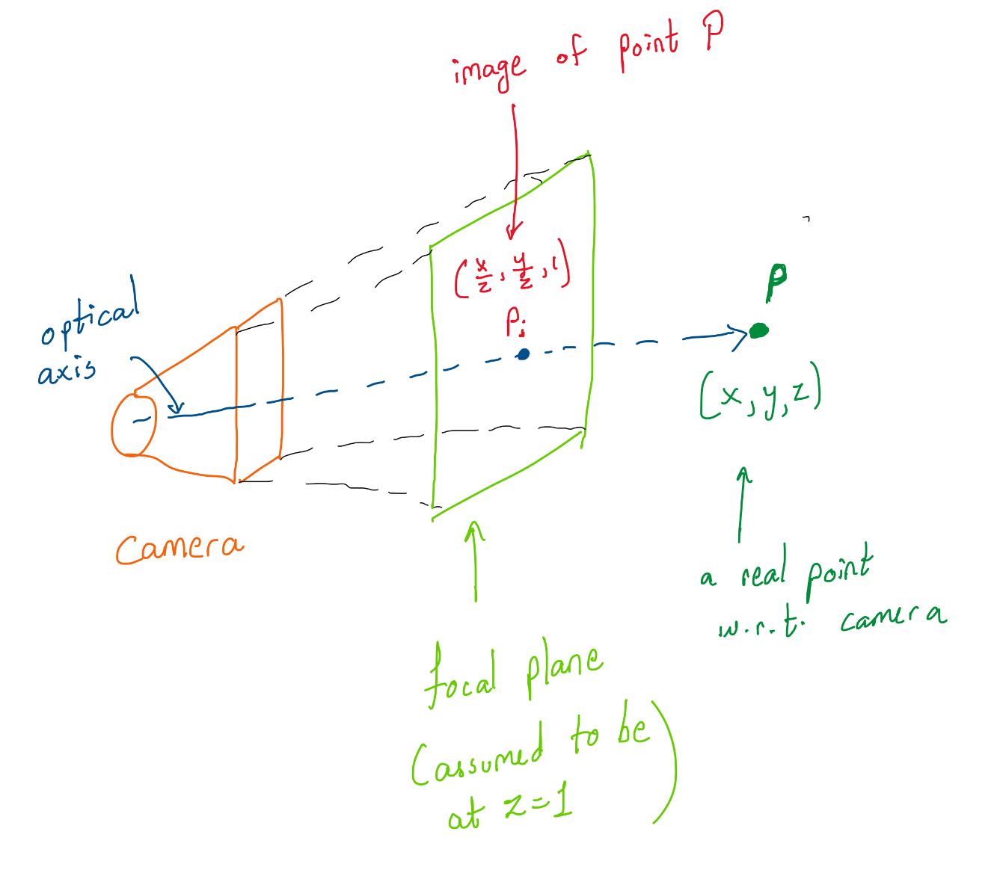

This is the first Tech blog on the website, many more to come. These blogs will be about something I find interesting from Engineering perspective, or some concepts I find myself revisiting often and I feel the need to keep them in an easily accessible place.  

Starting with one of the most important concepts from Classical Computer Vision (CV), structure from motion. There ideally aren't many resources that explain it well, so here is my take on explaining it. I was introduced to it from Prof. Kostas's class on Perception at Penn, and I shall be using his illustrations.  

Prerequisite:  
- Basic Computer Vision/ Camera geometry knowledge is a must  
- Knowledge of Linear Algebra (Eigen vectors, Null spaces)  
- Knowledge of Transformations  

*Applications*:  
- This is one of the key concepts in Multi-View Geometry. Although with Deep Learning taking over a lot of mathematically beautiful classical CV algorithms, this one still holds up well due to its light-weight and reliable nature. It is mainly used for mapping and hence, very well helps for localization with map as a prior.   
- Orthophotograph mossaics are useful for Geospatial applications  
- 3D reconstruction from 2D images: 2 eyes are well located to give us the stereo vision and thus, we can perceive depth of an object fairly well. However, there are many animals and birds who have their eyes with little to no overlapping FOV, the only way they estimate the distance to their prey is by differences between consecutive frames as they move. Their neurons are basically wired to perform the computations similar to the ones we shall be seeing now.      
- Also, 3D point cloud registerations are another key applications that are very well used for mapping by self-driving cars, as well as in many other robotic applications.  

So let's get into how it works.  

1. Correspondence Matching:   
Given the 2 images from 2 different views, first we need some set of feature correspondences as shown below.  

  

As seen, you create feature descriptors and match them against each other in the 2 images to find the matches. My implementation of that can be found on the image stitching project [here](https://github.com/Saumya-Shah/Image-Stitching). Although you only need a minimum of 4 pairs of matches (we'll see why), it always helps to get more to be more robust to outliers.
2. Formulating the problem:  

This is how camera sees the world. 

In general, the depth or 'z' is unknown, and it is one of the things to be estimated. The point we see in the image has to be projected outwards along the line joining the point to the optical center. We extend the ray by a constant which is the depth or distance of the point from the camera.  

Now, let us consider 2 different views of a point denoted by camera position C1 and C2. These may be 2 images by 2 cameras at the same time or by the same camera at different times from different positions. They are essentially the same problems for most scenes which do not change. Let us stick to case 2. We know the correspondences i.e. point pi and qi, but we do not know how the camera moved between the 2 instances, i,e. the transformation matrices R and T, and we do not know the depths or the constant by which we scale. The goal is now to find these unknowns. 

... to be continued

<!-- 3. Epipolar constraint:   -->

