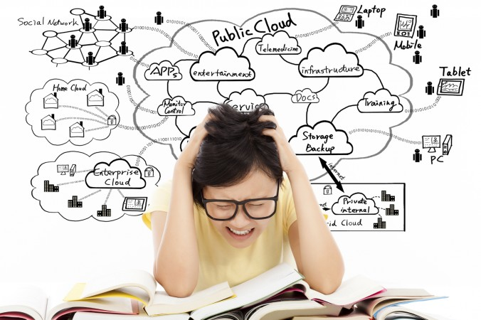

  

**Target Audience**  
Do you get too tired with getting much lesser done as compared to what you could before?  
Then this might be helpful. The pandemic has restricted the world to a rectangle. Screen is the source of all the information you have and can get, and with the "Social Dilemma", you have lost control of what flows out from the screen to a large extent. There is no dedicated workspace. Offices as well as the presence of people there restrict your access to and other unnecessary information while working. Similar is the case with students, the classroom and library environments help you stay on track most of the times. Also, the commutes and live interaction with others help you choose what you want to observe, listen, and read what you want to. All of it helped to have more control and focus while doing a certain task, but not anymore.  

**The Information Age**  
About a 100 years ago, the information was expensive. Everyone had access to only little that they required and could cope up with. The flip side was the pace of development was slow and there was no equal access. But it was within the human capability to grasp the information that was available. People could learn mostly everything there ever was about a field, and truly master it. Then came the information age. With the advent of better computers, thanks to the Moore's law, the pace of development has been exponential. In the last 50 years, from the first computer Eniac until now, the processing speed has gotten much better, and affordability has gone up tremendously. A lot more people had access to the platform - the internet, and information inflow to the internet had already begun. With the companies like Google and Yahoo, the search engines evolved. Search engines helped get information out more easily. Everything you required was soon at the tip of your finger tips. This was a boon, anyone about 200 years ago would have thought of it as a magic. A lot of businesses evolved with the internet, and a lot of service providers like Amazon seized the opportunity. This is all amazing, and it has certainly made lives much easier!  
The flip side? As individuals, the speed of evolution of human beings is virtually zero as compared to the pace of technological development that we have witnessed. You cannot compete with the machines anymore. We were left much behind in the memory race long ago, but we still had chances in the race of intelligence. This was only until we didn't have the internet. Internet provided a place to dump all the information generations have learnt in their lifetimes, in one place. This was the beginning. As long as humans were the ones who were dumping and retrieving the information, the scope was limited, we could control it. There was still no one better than humans. The search engines were just an optimized retrieval systems, nothing more. Even social media, like the early stages of Facebook, were a lot more positive than negative. The intent was to connect people and they did it well. But then came... 

**The Age of A.I.**  
A.I. has boosted the technological development enormously. The computers can process a lot more information, a lot faster. Even right now, we are all really cyborgs. As Elon puts it, your phone is a very powerful extension of yourself. It extends your memory, it extends your processing capabilities, and soon, it'll do a lot more. The optimistic side is, as Jack Ma sees it, humans will have more time with machines at work, more time to live a life, to enjoy and do what you love. That period is less than 10% today, most of the times you are doing what you have to do to get somewhere where you can finally live a life as you want to. There is a lot of potential to solve insanely high number of problems, one of which is self-driving and logistics. But on the way to it, there are a lot of challenges. One of which is information overload and mental health which is the scope of this article. 

Computers have more control over us, than we do on ourselves. Not everything we read is because we planned to read it. In fact, most of it is because we were recommended, and there was a false sense of "requirement" to read it. [Here, "read" extends to watching videos or consuming any kind of information.] This is the core problem when most of the time you are beind a magical rectangle. The pandemic has shown us the exaggerated problem. The reason you do not get much done is exactly this. The feedback loop keeps you away from working. You open Youtube, to watch a video you wished to. And then, soon you are hours on it watching more than what you wanted to. Same is the case when you endlessly scroll on Facebook or Instagram. [Dopamine](https://www.seas.upenn.edu/~saumya97/dopamine) is one of the factors, and has always been the underlying reason. However, it is only now that it has more effect when there is no one directly or indirectly supervising what you do. With work from home, you choose the hours you work at, and most often is the case that we do not have a strict schedule and boundary between work and life now. You have more freedom, and with that comes more responsibilies which we have failed to cope up with in this very short span. The work doesn't feel like work, you relax and are not as strict while working. Also, the life doesn't feel like life, you are worried about work during that. It's all messed up.  

*"The wisest is the one who knows not everything, but what he should know. You cannot know everything."*

### What to do?  
Your focus or attention has been the commodity, the media is after. With so much going on in the world, there is information overload. It is not the smartest one who wins the race today, but the most focussed one. Focus will determine how far you can go. If you can be distracted easily, you'll be the target most companies are looking for. And it is not easy to come out of that feedback loop, the deeper you are into the trap, the harder it'll be to come out, just like any other addiction. What can you do about it? The following are some of the practical steps I take and would suggest to anyone struggling with this problem. It may help anyone just looking to boost productivity:  

1. **Acknowledge the problem**  
If you do not know the problem, you cannot solve it. It is very common to justify what you do, and feel comfortable about the problems and not acknowledge them. You find excuses, and justify something that you deep down know is wrong. Watching an infotainment video or news, you convince yourself by saying it's useful to be aware of what's going on in the world, or that you are learning something. But you need to understand that it's a problem when that wasn't the intent, but you were lured into watching it.  

2. **Be mentally active**  
You need to be in the moment and analyze if you are doing what you should be doing, from time to time. Everyone has a life, has a story to tell, and a platform to put it on. You do not need to know all of it. There are a lot of countries and a lot of incidents, you do not need to follow every news. There is not much you can do about most of it and you are just wasting time reading about it when you could have done something better. You do not need to stay up-to-date regarding the Corona virus cases, they are just there and growing. **You do not need to know all of it.** There are a ton of [apps](https://www.sheknows.com/living/articles/955407/programs-that-limit-your-time-on-social-media/) that help you to analyze the time that's slippling from your hands, which someone else is benefitting from. Always be active, when you are amidst scrolling endlessly, take a pause and reflect. Do not fall into the trap even though it might "feel good". By no means, does it mean to stop it, but you need to gain control of it until the point where you can stop it if you need to. 

3. **Regular introspection** 
Introspect everyday or every two days what you did through the day. A good idea is to make a plan for the next day, every night and analyze what you got done on that day's plan. What more can you do to reach where you want to be, and what can you cut down to get more time to do what's necessary. When you spend sometime doing that, you will realize the blackholes which suck your time up, you will learn to prioritize. You will always have an endless list of things to be done, but you have limited time. You need to prioritize well, you need not get everything done because no one can. Eventually, with better understanding of how valuable your time is, and how you can be better using it, you will get more focussed. Meditation can help to improve mental health and to get some time out from the world and disconnect to get rid of all the external (and perhaps mostly unnecessary) information inflow, and introspect about yourself. 

4. **Stop Multitasking**  
Stop multitasking. You are not as effective as you think you are, and I have realized that it is not something to be proud of. There was a time when I would try to multitask and I would do it well (at least that's what I thought) and better than most. But the cost of context switching is high. Even if you can do multiple things at a time, you will be much better off doing one thing at a time. You can do one thing faster, and better.  

5. **TODO list**  
I have been using TODOIST a lot these days. It is great to keep track of all the tasks you need to get done, and even assign deadlines and priorities. It helps boost productivity when you have things broken down into achievable tasks than to have everything in head all the time. Get things down in the list, break the tasks into chunks that you can do, and clear the clutter from head. This way, you do not have to subconsciously worry about what you might be missing out, and focus better on the task at hand. Put down each and every task, however small on the list and group them well to not get an overwhelming list of tasks. Be active, clear the tasks you do not feel may be necessary everyday to avoid cluttering up the space. Use it wisely.

6. **Rigidity in schedule**  
One of the very effective tools I have felt has helped me a lot is Google Calendar. Schedule everything. I mean everything. Your bath, your sleep, your phone surfing time, lunch, dinner, everything. Even check your emails in the time you have alloted for it. Turn off all the notifications, all the calls, stay on the DND mode. Having a todo list helps you choose tasks from, and put them on the calendar when you plan for the day. This way, you only worry about the tasks when planning for them, and never while doing something. **If it is not on your calendar, do not do it.** You can integrate TODOIST with Google Calendar, but it's better to not get stuck with the sophisticated technology and start getting shit done. Keep your breaks scheduled, your free time also scheduled. Try to stick to it as much as you can. You may realize your planning is overambitious in the initial days, but soon when you realize, with practice you will get better at making a practical effective schedule.   

Feel free to add to the list in the comments below. Thanks for reading it.

Picture credits:  
1. https://www.mcgilltribune.com/opinion/information-overload-is-an-overblown-fear-613423/