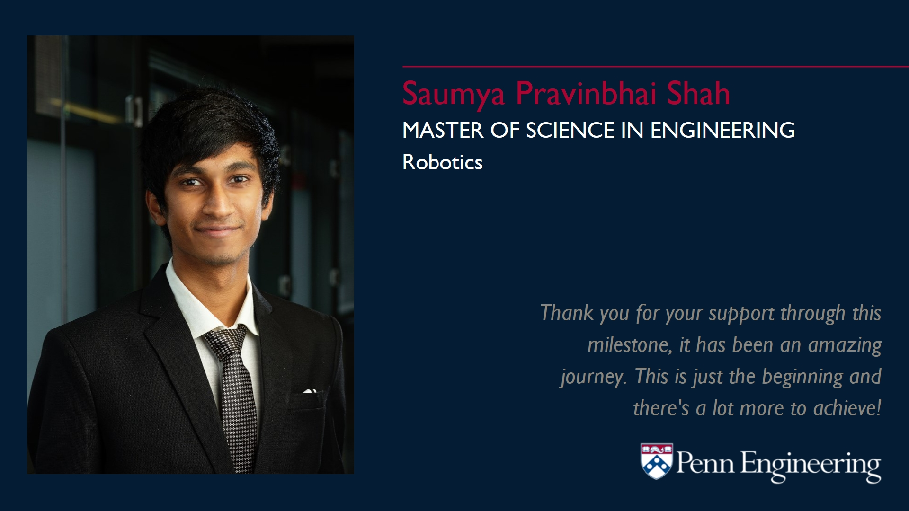

<!--  -->

  
As I cross another milestone in life, I take this opportunity to reflect on what it has been so far, cherish the moment for a bit and prepare for what's coming. I graduated on May 14th, 2021 from the University of Pennsylvania with a Master's degree in Robotics. I would like to take a moment to thank my family for their support and for allowing me to pave my own path, a handful of very special people without whom this wouldn't have been as interesting and comfortable, the amazing teachers I was fortunate to have, the people I have met, and finally a lot of luck without which all of this would not have been possible amidst the unprecedented pandemic. The last decade, especially the last 6 years away from home have been an incredible journey of ups and downs, but this one shall mostly be about the last 2 most expensive and rewarding years of my life.

The feeling is best captured by Azar Nafisi's quote:

> "You get a strange feeling when you’re about to leave a place, I told him, like you’ll not only miss the people you love but you’ll miss the person you are now at this time and this place, because you’ll never be this way ever again"

The moment is bitter-sweet not just because I leave the University, but also leave behind the tag of being a student, the safety bubble that comes along with the tag. All my life, I had officially been a student, the environment at schools, colleges and universities had always provided an invisible bubble of safety which a lot of us fail to appreciate until we lose it. It provides us an environment where we do not have serious responsibilities, where we are free to experiment and learn about ourselves better. It's the training period before we are deployed in the real world and realizing this itself can change a lot of things. You are allowed to make mistakes and learn from them at a very little cost. If you still have years left as a student, I would envy you because I wished someone had told me this before, and I hope you can be a little more careless to make mistakes and go out of your way to be unconventional. I had taken little risk and played it quite safely to stay at the top of the game, without realizing that the real winners of the game were the ones who failed often and had more opportunities to learn without any obligations to please themselves and others through their achievements.

As I reflect on the past, it's important to recognize the positives, the things I have gained and the things I have gotten better at.

1. **Knowledge**  
   The first thing is quite obvious yet very important. I had for a long time underestimated the importance of knowledge. I have some reasons to believe I am intelligent, but I had for a long time made a mistake to attach a negative feeling to knowledge by associating it with memory. But it fortunately did not take me long to realize that intelligence cannot do much without knowledge. Knowledge provides the tools for intelligence to work with. It is just as important if not more, as only with primitives or the fundamentals can you build complex things. I do not usually advocate for status of the universities, but the Ivy-League status attracts the best of the people in the world and it's really the people you get to interact with that makes all the difference as a lot of you is the reflection of people around. I was fortunate to have this opportunity to learn from the best in the world. I know better now, and I have learnt that there's a long way to go.
2. **Persistence**  
   From being a gold medalist in Bachelor's to getting a 4.0 GPA with 8 A+'s out of 10 in Master's, I was fortunate to have been generously rewarded for all my years of persistence and discipline. It isn't about showing-off, and it certainly wasn't about grades but instead, was purely about attaining the excellence, having utmost clarity and understanding of concepts and having the will and determination to achieve perfection.

   This quote from the movie "The Founder" captures the notion most adequately and has had a deep impact on my life, I cannot explain it better.

   > "Nothing in this world can take the place of persistence. Talent won’t; nothing is more common than unsuccessful men with talent. Genius won’t; unrewarded genius is practically a cliché. Education won’t; the world is full of educated fools. Persistence and determination alone are all-powerful."

3. **Confidence**  
   With all the experiences and learnings, I have grown to be more confident as an Engineer and more so as a person. Meeting the best minds of the world, learning from them, working with them, and having the opportunity to gauge myself against them has helped me improve and become more confident about my skills, thinking abilities and work ethics. From being too shy to raise a hand in class to even answer a question in school, to raising intellectual questions for the experts at the university, I feel I have come a long way. I am no longer shy about asking a stupid question in front of a huge crowd, and have strengthed my belief that no question is stupid. It's only a win for me if I see everything as an opportunity to learn and leave all the stigmas behind. The major factors contributing to this are certainly the knowledge and results of persistence that I have gained. I have also gained confidence through various experiences to believe that if I put enough time into something, I am capable enough to do anything and it's just a matter of patience and persistence.

4. **Judgement**  
   I have developed a better sense of judgement. The pandemic has helped me empathize with people better. I have learnt that everyone has a story we do not know, and also that there's a limit to the number people you can empathize with and there's only so much you can do to make some things better. I have learnt more about myself and have a much better judgement about my capabilities to know that I can push myself farther, yet the upper limit remains to be discovered. I have learnt to gauge the situations better, and make decisions which are mostly good. I have also learnt that I do not need to ponder a lot over a decision as many of the decisions have effects that are reversible and it's okay to make some mistakes while going fast. I have learnt to get things done, and as I know myself better, I have learnt prioritize better as per what's important to me and more importantly, what's not.

There are also many things that I have lost on the way, a few of them include:

1. **Ego**  
   The more people I meet here, the more I know about how much I do not know. I have gained better sense of where to shed the ego and where to shine it, which is ideally no where. Looking at the people who have achieved so much being so low-key, I have learnt to be a lot more humble. I realize how far I am from what is possible to achieve, and how much people can lose when ego guards them from accepting knowledge.
2. **Reliance on luck**  
   I have learnt to not blame luck for anything that goes wrong, but at the same time, give it credits when things go right, which is quite opposite of what I observe in the majority. You have no right to blame luck if you haven't done everything you could have, to get something. At the same time, if you have done everything you could have, you will be very satisfied with yourself even if you fail, and wouldn't think of blaming luck for anything. There are always some things which are not under your control, but be sure to have done everything that is under your control before lurking at luck to blame your failure on.
3. **Introversion**  
   Growing up in family where I would be always compared with my brother about how well he did socially, and be the life of every party, I chose to not be a part of the something I didn't think I could have done better at. But coming to the United States, I had an opportunity to recalibrate and restart. Getting used to the short-talk culture, and taking effort to find something in common to have a discussion about, I learnt that talking to people isn't a task or a challenge, but rather an opportunity to learn about them and it got the better of me. I have also reduced the number of speech filters as I grew less innocent and more confident to ask and say things irrespective of how it would affect others' perception of me, while having more of the empathy filter on it and a better sense of how it might affect others.
4. **Attachments**  
   As I realize more about what's important to me and what isn't, I have learnt to be less attached to things and titles, and better balance attachments with people. I can now better invest my time, energy and attention on building better relations with a handful of people that really matter, and have grown smarter in choosing the sacrifices I make. All these years I have been away from family and there has been very little to no interaction with all of the relatives back in Mumbai. I have lost some to gain some, but I hope I can catch up and mend those soon.

Some of the highlights of the last 2 years:

- Pursuing Master's in Robotics was certainly one of the best decisions I ever made. I realized being good at something did not mean that it was what I wanted to do. Mechanical Engineering was one such thing. But I am fortunate to have made this decision and it has certainly changed a whole lot in my life for better. At this point, I am very satisfied with what I have gained here and it was all more than worth the while.
- It wouldn't be fair to not mention Covid on this list. The last 14 months have been very eventful, covid changed a lot of things for everyone of us in some or the other way. I believe personally it has done more good than bad for me, as I chose to focus on the positives and make the best of it. But it certainly is disheartening to see the sufferings of people around.
- At around this time last year, I had a decision to make. I had 2 choices, one was to continue the Fall semester as conventionally done by most students, and the other to work through the Fall semester and gain experience, followed by an incredibly heavy Spring semester with double the expected workload. One seemed quite convenient and easy while the other required me to take risk and leave the comfort zone. There was also a lot of uncertainty involved around job search as, if it wasn't completed, the spring '21 semester could have been an immense challege with unexpected outcomes. I am glad I chose to take the risk. Having faith in my capabilities, I made it through with great experiences and best of the outcomes. I couldn't have asked for anything better.
- The final semester had been quite eventful as well. I had 4 courses which were seemingly difficult, and compared to the conventional 2 courses for the last semester, it was more burden. Having managed the courses quite comfortably itself was quite a feat. One of the most cherished moment was appreciation from Professor Kostas Daniilidis, and his generous offer to have me as his PhD student. He is among the top researchers in the field and this really made me feel honored. Another highlight was having led the Database course project's amazing team to get the most technical project award.
- On a lighter note, I achieved the maximum typing speed of 105 wpm!!
- The job search was a highlight of its own given the pandemic. It wasn't easy and there were a lot of takeaways. I learned to be optimistic and hopeful when things did not go well, to have patience, to trust myself, to network with people better and to present myself to the best of my abilities. I also learnt to empathize with people who had not landed a job yet, to be more helpful to them. It was however more difficult comparitively to deal with other side of the coin, i.e. rejoicing others' job offers when you yourself do not have one. There's envy, jealously, worry, and multitude of negative emotions attached to it, and it was one important lesson of learning to celebrate others' success, appreciate their efforts and being proud of them. It was certainly rewarding at the end as I had some amazing offers to choose from. Again, I couldn't have asked for anything better.

Most of all had been an amazing experience, but I am not afraid to accept there were some shortcomings and it wasn't all perfect. There are some things that could have been better.

- I wish I had met more people at Penn. Due to the pandemic, after remote operations, I did not make as much effort to network and connect with people as I could have. Meeting more people who are better than you at something provides you an opportunity to grow and I hope I get better at it and focus on it more soon.
- I also realized that I could have done better if I had taken Computer Science as my major in undergraduate. Now when I look back, I see how much time I had spent on courses that would play little to no role in times to come. I had to get them done as a part of major requirements and even though the intelligence and knowledge I have now is cumulative of all of it, I believe I could have used a lot of that time better. I do not regret even an hour of hundreds of hours that were spent at Penn. That certainly is a positive from undergraduate, that I appreciate this experience a lot more, but it still is a contender for top spot on my list of regrets.
- Finally, I believe there is a lot more potential in me yet to be realized. Even the most hectic semester so far did not seem to have pushed me beyond the limits. I believe I could have taken more risks, played less safely with some of the choices and pushed myself further. I hope I can do that better in the future.

To conclude, I would like to mention some anticipations about my journey ahead briefly. With less than a month left to begin my first professional experience as not being a student, I shall be joining [Skydio](https://www.skydio.com) in Redwood City, CA on June 15th. One of the most important factors contributing to my decision to join Skydio over some of the top companies was the exclusive team of some of the smartest individuals. The drones are exciting and so is moving to California and leading a better lifestyle, but what excites me the most is the Autonomy team I had interacted with during the interviews which was incredibly sharp and immensely humble. If you have seen the performance of Skydio, you wouldn't believe that the autonomy team is only 20 people strong and I feel previleged to have an opportunity to be one of them. I don't think I could have asked for a better job to start my career with. I have never been this excited for anything else in my entire life, and I hope I learn and grow as a person while making significant contributions to the technology. I shall post an update soon as I settle in with the job, but for the moment, I shall take a break to cherish what has been achieved. This is not just an end, but also a new beginning, and there's a lot more to achieve!
